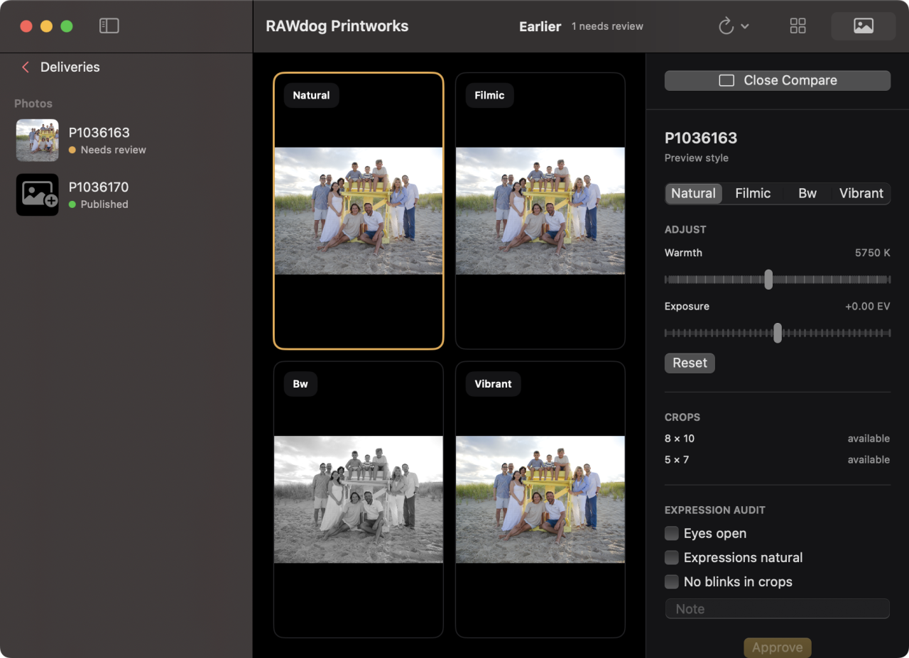

# RAWdog Printworks

[](https://github.com/johncioni/rawdog-printworks/actions/workflows/tests.yml)

A resumable RAW → print-ready photo pipeline. Drop Panasonic GH7 `.rw2` files in,
review each one through an explicit approval gate, and get back a complete set of
archival TIFs, lab-ready JPGs, and PDFs — 22 files per photo, published atomically.



## What this is

A personal tool, built for one photographer and one camera, published because the
design might be useful to read. It turns family-shoot RW2 files into
print-and-frame-ready output in a restrained, natural style — explicitly
correcting an over-processed, over-saturated original look.

It is not a general-purpose product: it is macOS-only (it calls the Vision and
Quartz frameworks through pyobjc), it assumes a Panasonic Lumix DC-GH7, and it
pins every external render tool to an exact version and hash in
[`config/toolchain.lock`](config/toolchain.lock). Expect to adapt it rather than
install it.

## Why it's built this way

Three ideas carry most of the design, and each exists to make the pipeline safe to
re-run at any moment.

**Photos move through an explicit state machine.** Per photo:

```
ingested → preview_ready → review_required → approved → rendered → verified
```

The driver is resume-safe. Re-running advances every photo from wherever it
already is, so an interrupted batch costs nothing but the work in flight.

**Approval is a fingerprint, not a flag.** Approving a photo records a hash over
every input that can change rendered pixels — the RAW's SHA-256, the style
sidecars, crop geometry, the sharpening recipe, the RawTherapee config seed, the
rendering entries of `toolchain.lock`, and the lab profile's review fields. If any
of those change later, the photo transitions *backward* to `review_required`.
Nothing reaches the lab that a human didn't visually approve in its exact current
form.

**Publication is atomic.** Renders are written to `staging/<stem>.tmp/`, renamed
into an immutable `Output/photos/<stem>/vNNN/`, and exposed by swapping a
`current` symlink. A crash mid-render leaves the previous version intact, and
startup recovery resolves orphaned staging directories from manifest state.

Crop placement is subject-aware: faces are detected in the rendered preview via
the macOS Vision framework, and the crop window is positioned so the group's
center lands as close to the window center as the frame allows. Detection only
chooses framing — it never edits pixels — and the operator reviews every crop
regardless.

## Output matrix (per photo)

| Format | Contents | Count |
|--------|----------|-------|
| TIF | 16-bit sRGB archival masters, native ratio and pixels — one per style | 3 |
| JPG | 3 styles × 3 crops (native, 8×10, 5×7) | 9 |
| PDF | Lossless `img2pdf` wraps of the 9 JPGs | 9 |
| PDF | Style-comparison review sheet | 1 |

Named `<stem>_<style>[_<crop>].<ext>`. The delivered styles are `natural`,
`filmic`, and `bw`; a fourth profile, `vibrant`, ships for preview and comparison.
JPGs are the only lab submissions — TIFs are archival masters and PDFs are for
review, sharing, and home printing.

## Requirements

macOS, Python 3.14, and a `.venv` at the repo root. External tools —
RawTherapee 5.12 (the CLI is the primary render engine), exiftool, ImageMagick,
img2pdf, qpdf, and poppler — are resolved through `config/toolchain.lock`, which
records the path, version, and SHA-256 of each.

RawTherapee is primary because its `.pp3` profiles are plain text, which makes
precise per-image tuning tractable; darktable's encoded XMP parameters are not.

## Usage

Every command runs through the repo `.venv` — never system Python.
`scripts/process.sh` is the wrapper:

```bash
scripts/process.sh status                      # read-only; safe any time
scripts/process.sh ingest --from <paths>       # archive RAWs with SHA-256
scripts/process.sh preview <stem> <style>      # export a review preview
scripts/process.sh crops --stem <stem>         # place crop windows
scripts/process.sh approve <stem>              # record the approval fingerprint
scripts/process.sh render <stem>               # render the full output set
scripts/process.sh verify <stem>               # check published output
scripts/process.sh run [--stem <stem>]         # advance everything it can
```

Most commands also accept `--json`, which emits NDJSON on stdout with an envelope
last. That interface is what the macOS app drives, and the golden fixtures in
`tests/fixtures/json_contract/` are its authority.

Mutating commands take a non-reentrant lock; `status` never does.

## The macOS app

`app/` holds a SwiftUI front end for the review loop — the sidebar, style
comparison, crop overlay, and inspector shown above. It is deliberately thin:
all pipeline logic lives in Python, the app never writes to the repo itself, and
it invokes the pipeline with argv only. `PrintworksCore` carries the logic and its
tests; `RAWdogPrintworks` is the app target.

```bash
scripts/build-app.sh    # xcodegen + xcodebuild, ad-hoc signed
```

## Layout

```
pipeline/     the Python pipeline (driver, render, publish, verify, …)
app/          SwiftUI macOS front end
config/       style profiles, lab profiles, RawTherapee seed, toolchain.lock
recipes/      per-photo recipes — approval fingerprints and crop geometry
sidecars/     per-image .pp3 overrides
tests/        pytest suite, including the JSON contract fixtures
docs/         design specs, implementation plans, QA archive
```

`recipes/`, `sidecars/`, and `config/` are committed durable state — the record of
what was approved and why. Photo data (`Input/`, `Output/`, `archive/`,
`staging/`, `previews/`) is gitignored but is live data, not scratch.

## Tests

```bash
.venv/bin/python -m pytest tests/ -q
```

The full suite is the quality gate and runs in CI on macOS. It shells out to the
real render tools rather than mocking them, so the gate installs exiftool,
ImageMagick, img2pdf, qpdf, poppler, and RawTherapee.

## Documentation

There is no separate manual — the specs are the reference.

- [RAW → print pipeline design](docs/superpowers/specs/2026-08-11-raw-print-pipeline-design.md) — the canonical spec
- [macOS app design](docs/superpowers/specs/2026-08-12-macos-app-design.md) — the app and the `--json` contract
- [`docs/superpowers/plans/`](docs/superpowers/plans/) — implementation plans
- [`docs/superpowers/sdd-archive/`](docs/superpowers/sdd-archive/) — QA screenshots and review records
